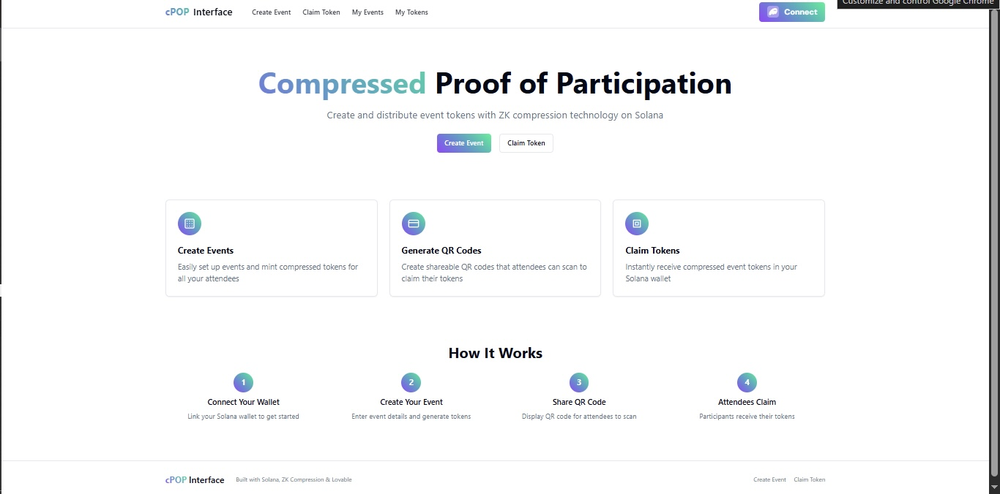

# cPOP Interface - Compressed Proof of Participation



## About cPOP Interface

cPOP (Compressed Proof of Participation) is a Solana-based application that allows event organizers to create and distribute compressed tokens as proof of participation for attendees. Using ZK compression technology from Light Protocol and Helius, cPOP makes token issuance affordable and efficient.

## Features

- **Create Events & Mint Tokens**: Easily set up events and mint compressed tokens for your attendees
- **Generate QR Codes**: Create shareable QR codes that attendees can scan to claim their tokens
- **Claim Tokens**: Instantly receive compressed event tokens in your Solana wallet
- **Token Management**: Track events you've created and tokens you've claimed

## How It Works

1. **Connect Your Wallet**: Link your Solana wallet to get started
2. **Create Your Event**: Enter event details and generate tokens
3. **Share QR Code**: Display QR code for attendees to scan
4. **Attendees Claim**: Participants receive their tokens by scanning the code

## Technology Stack

- **Frontend**: React with TypeScript, Tailwind CSS, and shadcn/ui
- **Blockchain**: Solana (Devnet) with Light Protocol for ZK compression
- **Token Standard**: Solana Compressed Tokens (cTokens)
- **API Services**: Helius for enhanced Solana RPC access
- **QR Technology**: QR code generation and scanning functionality


### Using your preferred IDE

If you want to work locally using your own IDE, you can clone this repo and push changes. Pushed changes will also be reflected in Lovable.

```sh
# Clone the repository
git clone <YOUR_GIT_URL>

# Navigate to the project directory
cd <YOUR_PROJECT_NAME>

# Install dependencies
npm i

# Start the development server
npm run dev
```


## Credits

Built with Solana ZK Compression & Light protocol
